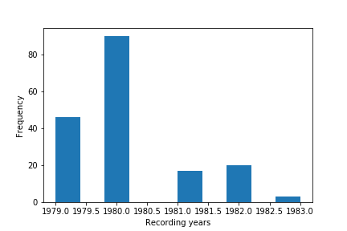

# Testimonies of the Yale Fortunoff Archive

[todo: change data repo links once finalized]
Cite as: Gabor M. Toth, <i>In Search of the Drowned, Testimonies and Testimonial Fragments of the Holocaust</i> (Place: Publisher, Year), URL.

The Fortunoff Video Archive for Holocaust Testimonies (henceforth, Fortunoff) provided 176 testimonies to this project. In this section you can read about these 176 testimonies. First I summarize the history of the testimonies in the collection; second, after giving a short overview of the interview methodology underlying the testimonies, I am offering a quantitative description of the data set.[[1](#fn-1)]

<h2>History of the testimonies</h2>

The testimonies that the Fortunoff Archive shared were all recorded as part of the Holocaust Survivors Film Project. This was a small grassroot project organized by survivors in New Haven in the second half of the 1970s. Precisely, the Holocaust Survivors Film Project was the idea of the psychatrist and survivor, Dori Laub, and Laurel Vlock, a local television personality. The importance of the project is given by that this was the first broad effort to videotape testimonies of Holocaust survivors. The Holocaust Survivors Film Project was active in the late 1970s. In 1981, the collection of testimonies that the Holocaust Survivors Film Project recorded was deposited at Yale University Libraries. This initial data deposition gave rise to the Fortunoff Video Archive.

<h2>Interview Methodology</h2>

‘Survivors for survivors’ was the ethos driving the Holocaust Survivor Film Projects. In the 176 testimonies,  usually survivors interview other survivors. However, their role is not to interview but to listen to the stories of fellow survivors and let them tell about their troubled past. In addition to the ethos, ‘survivors for survivors’, empathic listening was another important component of the Holocaust Survivor Film Projects. In practice, empathic listening meant that interviewers did not have a clearly defined set of questionnaires; interviewees were free to talk about what they wanted without being imposed to account their past through a chronological framework. As Dori Laub, who actually designed the interview methodology, described, the goal of the interview is to facilitate a free flow of memory without standard questions and time limits. As a result, in the Fortunoff testimonies interviewers  ask fewer questions, which aims to clarify time and space if unclear.

<h2>Gender Distribution</h2>

The distribution of men and women is very well balanced; 41 % men and 45% women; the remaining 13% consists of those interviews that are given by multiple interviewees. The presence of multiple interviewees is actually a peculiarity of the Fortunoff data.

<h2>Age Distribution</h2>

Most of the interviewees were in their late fifties or early sixties when their testimonies were recorded; the vast majority of them were therefore born in the first half of the 1920s. 

The Fortunoff dataset also contains some interviewees who were already in their eighties when the interviews were recorded. The year of birth of the oldest interviewee is 1892. The age distribution of women and men follow the same pattern. Actually, the majority of both women and men were 58 years old when the interviews were recorded.

<h2>Country of Origin of Interviewees</h2>

In total, the dataset contains wittnesses of the Holocaust who were born in 20 different countries. Nevertheless, the majority of interviewees were born in Poland (91 survivors) and Germany (24 survivors). Other - minor  - groups of interviewees were born in Hungary, Austria, Slovakia, and Ukraine.[[2](#fn-2)]

<h2>Interview Locations</h2>

Most of the interviews were conducted in New Haven, Connecticut and New York. Thirteen interviews were conducted in Israel, otherwise interviews were recorded in the United States.

<h2>Recording years</h2>

Most of the interviews were recorded in 1980 and in 1979 (the earliest interview is 1979 and the latest is 1983).

<h2>Interview lengths</h2>

The spread of interview lengths is quite large in the Fortunoff Dataset. The longest interview is almost 40.000 words, whereas the shortest five interviews are below 5000 words. The average length is approximately 13000 words. Most of the interviews are between 10.000 and 15.000 words. 

1. The research code used to prepare this section is in the following github repository. https://github.com/toth12/data_analysis_lts

2. Data used to prepare this section was produced and provided by Jake Kara (Yale, Fortunoff Archive). Since a computational approach was applied to extract interviewees' country of birth, the data is not completely accurate.

