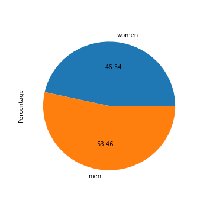
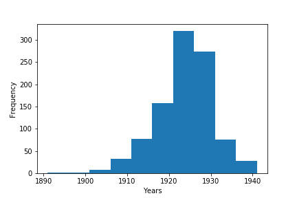
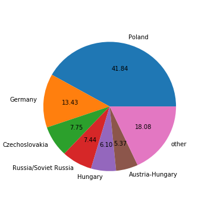
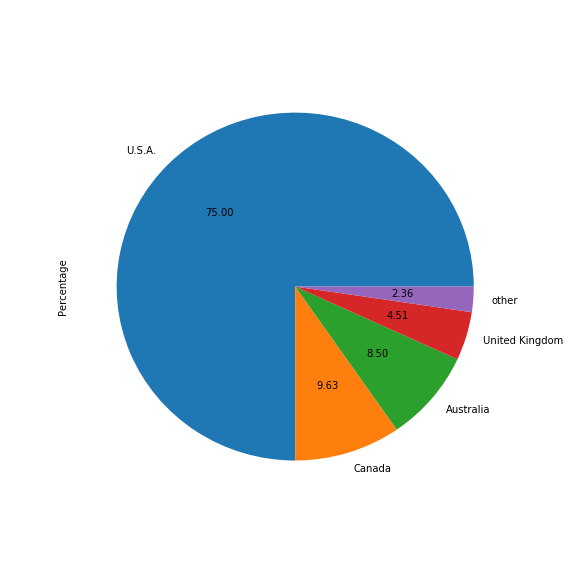
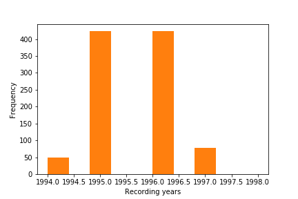
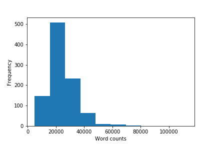

# Testimonies of the USC Shoah Foundation Visual History Archive

[todo: change data repo links once finalized]
Cite as: Gabor M. Toth, <i>In Search of the Drowned, Testimonies and Testimonial Fragments of the Holocaust</i> (Place: Publisher, Year), URL.

The USC Shoah Foundation provided 976 testimonies to this project. Here you can get more information about these 976 testimonies. First I summarize the history of the testimonies in the collection; second, after giving a short overview of the interview methodology underlying the testimonies, I am offering a quantitative description of the data set.[[1](#fn-1)]

<h2>History of the testimonies</h2>

The USC Shoah Foundation was founded in 1994 with a generous donation from Stephen Spielberg. Today it preserves 55.000 testimonies of various genocides. The 976 testimonies featured in this edition is in fact only a small portion of their entire collection. 

<h2>Interview Methodology</h2>

The interviews provided by the Shoah Foundation are life interviews; these interviews cover the interviewee’s entire life, including their prewar life, war time experience, and postwar experience. Interviewees are asked to tell their life in a chronological order and additional questions are asked if clarification is needed. The key role of the interviewer is to ensure that the narration goes in a chronological order. In addition to the chronological narration, USC interviews often end with general reflections in which interviewees can give a broader overview of their entire experience or leave a message to future generations. Sometimes family members are present when the interviewees offer these general reflections. In the last part of the interviews interviewees also often show photos of murdered relatives and friends or present personal artifacts.

The goal of the USC interviews was also to produce general information about the historical context. Interviewers were for instance advised to research the specific historical context and ask questions about that. While the Fortunoff interviews mainly aim to produce personal memory, the USC interviews also aim to preserve broader insights into the historical context.

The USC interviewers were also instructed to adapt to the narrative style of the interviewees. For instance, they were advised to offer guidance with specific - open ended- questions in case the interviewee encountered difficulties. 

USC interview usually begin with the following questions:

-What is your name (and spelling)?

-What was your name at birth (and spelling)?

-Did you have any nicknames as a child?

-What is your date of birth?

-What is your current age?

-What is your city (and spelling) and country of birth?

<h2>Gender Distribution</h2>

The gender distribution of the USC dataset is quite balanced; the total number of women is 444 interviewees (46,5%) and the total number of men is 510 (53.5 %) interviewees. The USC data does not contain double interviews. 

<h2>Age Distribution</h2>

Most of the interviewees were born in the 1920s. The oldest interviewee was born in 1891 and the average year of birth is 1923. The average year of birth of men is 1922 and the average year of birth is 1924 for women. Age distribution between men and women is quite similar. When interviews were conducted, interviewees were usually in their early seventies.

<h2>Country of Origin of Interviewees</h2>

Most of the interviewees (almost half of them) were born in Poland. The second largest group of survivors were born in Germany, Czechoslovakia, Russia/Soviet Russia and Hungary. In total 27 different countries are in the data set.

<h2>Interview Locations</h2>

The overwhelming majority of interviews were recorded in the USA (732 interviews, 75%), Canada (94, 10%), Australia (83, 8.5%).

<h2>Recording years</h2>

The interviews were conducted between 1994 and 1998. The majority of interviews were recorded in 1995 and 1996.

<h2>Interview lengths</h2>

The length of interviews provided by the Shoah Foundation tend to be longer than the interviews of the Fortunoff Archive and the USHMM. On average, interviews contain 24500 words. There are twenty interviews that are shorter than 10000 words and nineteen interviewees that are longer than 40000 words.

1. The research code used to prepare this section is in the following github repository. https://github.com/toth12/data_analysis_lts

