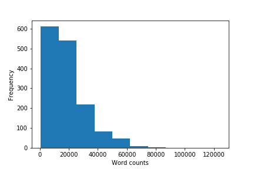

# Testimonies of the United States Holocaust Memorial Museum

<b>Cite as</b>: Gabor Mihaly Toth, <i>In Search of Drowned: Testimonies and Testimonial Fragments of the Holocaust</i> (Yale Fortunoff Archive, 2021), lts.fortunoff.library.yale.edu

The United States Holocaust Memorial Museum provided 1514 testimonies to this project. Here you can get more information about these testimonies. First I summarize the history of the testimonies in the collection; second, after giving a short overview of the interview methodology underlying the testimonies, I am offering a quantitative description of the data set.[[1](#fn-1)]

<h2>History of the testimonies</h2>

The United States Holocaust Memorial Museum was established in 1993; its archive preserves millions of items related to the Holocaust. Among these items, there are thousands of oral history testimonies. The 1514 testimonies that are part of this edition are only a small fraction of them. The USHMM both produced testimonies and collected testimonies produced by other projects. By looking at the provenance information of each interview, you can find further information about the provenance of an interview.

As a result of many different provenances, the 1514 USHMM testimonies are highly heterogeneous. Most importantly, they were not conducted based on one specific interview methodology. Metadata describing them is also highly heterogeneous, which makes their quantitative description difficult. For instance, information about interviewees’ country of origin, place and date of birth are not available. Similarly, the USHMM catalogue does not contain direct information about where an interview was conducted.

In some cases the interview transcripts and the original recordings do not match. In some other cases, transcripts are incomplete; sometimes transcripts are just summaries, though they appear in the USHMM catalogue records as transcripts. Due to the size of the data, it was impossible to identify these errors. Readers are asked to assess the information carefully in each case.

<h2>Gender Distribution</h2>

The gender distribution of the USHMM dataset is less balanced; the total number of women is 569 interviewees (40 %) and the total number of men is 854 (60%) interviewees.

<h2>Recording years</h2>

The recording years of interviews by the USHMM are wide-spread. The earliest interviews were conducted in the 1970s and the latest ones in 2010s. The majority of interviewees were conducted around 1990.

<h2>Interview lengths</h2>

The length of interviews also vary a lot in the dataset. For instance, some of the interviewees are extremely short, they contain less than 1000 words.  (It might be that some of these interviews are erroneous). And there are two interviews that are longer than 100.000 words. But most of the interviews are around 15000 words long.

1. The research code used to prepare this section is in the following github repository. https://github.com/toth12/data_analysis_lts

