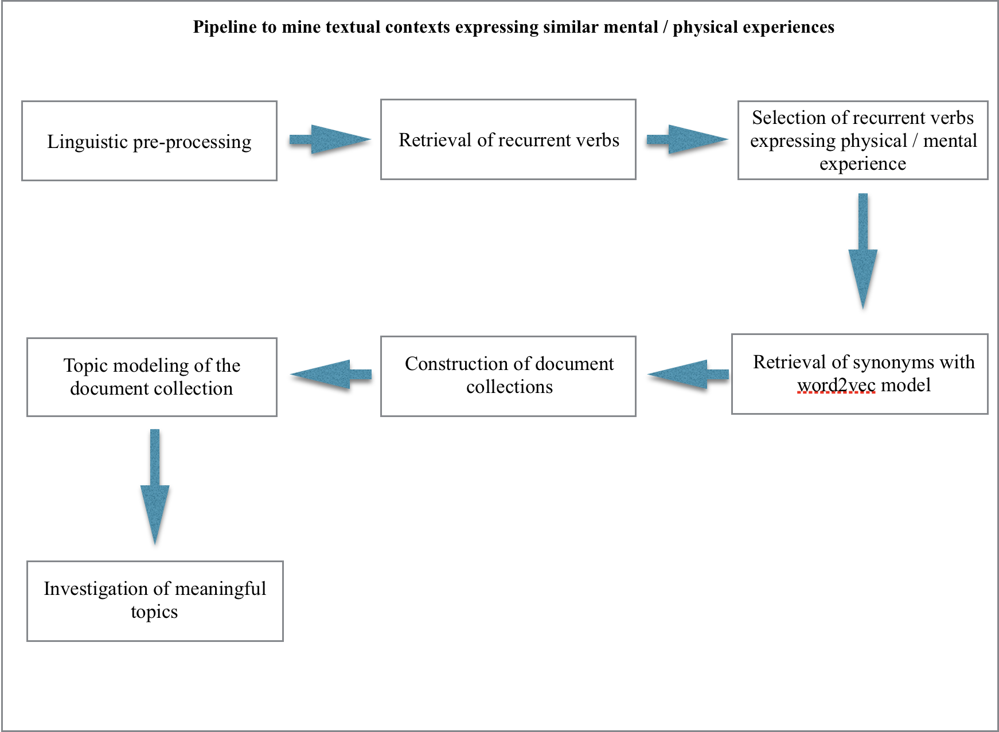

# Mining Testimonial Fragments

[todo: change data repo links once finalized]
Cite as: Gabor M. Toth, <i>In Search of the Drowned, Testimonies and Testimonial Fragments of the Holocaust</i> (Place: Publisher, Year), URL.

To find some (and definitely not all) pieces of the collective experience in thousands of testimonies, I applied text and data mining. As explained throughout my [Essays](/essays), my goal was to retrieve textual fragments from testimonies that describe recurrent physical and mental experiences shared by the Survivor and the Voiceless. I present this computational process in the following publication:

"Recovering and rendering silenced experiences of genocides: testimonial fragments of the Holocaust", <i>Digital Scholarship in the Humanities</i>, Oxford University Press, accepted and forthcoming (already available: https://doi.org/10.1093/llc/fqaa025)

Here I am summarizing my computational process, which is available in this <a href="https://github.com/toth12/mining_testimonial_fragments_of_the_holocaust/" target="_blank">repository</a>.  However, to understand the following explanations, readers need a basic training in text mining.

<h2>1. The computational challenge</h2>

The retrieval of textual contexts that describe similar experiences is a text mining task that raises two challenges. First, non–native speakers use different vocabulary, as well as different grammatical constructions, to describe the same experience. Second, retrieving different sentences with similar meaning is an unresolved research problem.

<h2>2. The pipeline approach</h2>

Given that today there is no out-of-box algorithmic solution to retrieve sentences expressing similar physical or emotional experiences in textual data, I have designed a specific pipeline; this involved both algorithmic and human supervised stages. The diagram below summarizes the pipeline.

As a first step, the transcripts of the oral history interviews published here underwent a standard linguistic pre-processing, which included the following steps (see a more detailed explanation of them in the [Section about linguistic annotation](MethodsLinguisticAnnotation) ):

-tokenization

-sentence splitting

-linguistic annotation

-detection of multiword expressions 

The first step of the pipeline produced a 60 million word corpus. You can search this corpus in the [Search](/search) section of this publication.

As a second step, I computed the document frequency of all verbs, including multi-word expressions; I labelled verbs with document frequency above the median as “recurrent.” To identify those verbs that express either physical or emotional experience, I examined all verbs (including multi-word expressions) that were labelled as recurrent. Next, with an embedded word model, I also identified their synonyms. This allowed me to work with synonym sets describing emotional, mental, and physical experiences in the testimony corpus.

As a third step, I applied the technique of Latent Dirichlet allocation (LDA, also known as topic modeling). From the occurrences of a given synonym set I created a document collection. By occurrence, I mean all sentences (including the preceding and the following sentences) in which a member of a synonym set occurs. Next, I trained a TF-IDF based LDA model from all occurrences of a given synonym set. This produced groups of words, also known as topic words, that tend to co-occur. For instance, the following group of words was extracted from the document collection constructed from all occurrences of nakedness and its synonyms:

<i>kill; shoot; grave; dig; make; fight; machine_gun; ditch; show</i>

This group of keywords uncover a recurrent experience often narrated by survivors:

"<i>They would beat them to undress and shoot them and bury them -- and then had to bury them.</i>"

"<i>Because about, they were all, they made them undress and they were shooting them and they were falling into the graves.</i>"

The last stage of the pipeline was the supervised analysis of the recovered sets of topic words. In short, I identified the recurrent experience behind each group of topic words and collected testimony contexts exemplifying it. 

Finally, from the testimony contexts identified throughout the previous stage, I created the testimonial fragments as presented in the [Fragments section](/tree).
